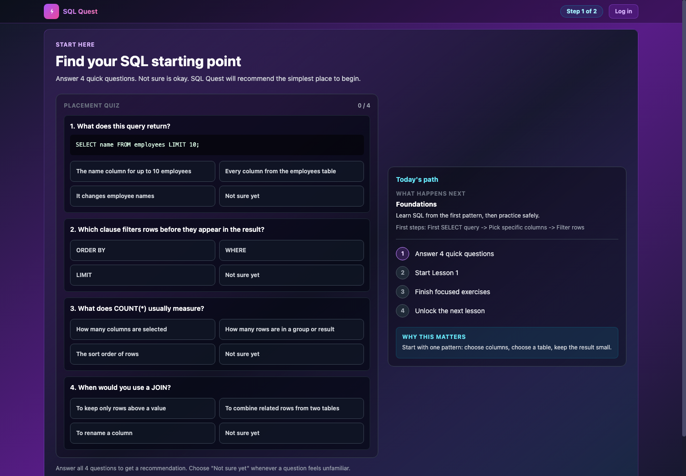
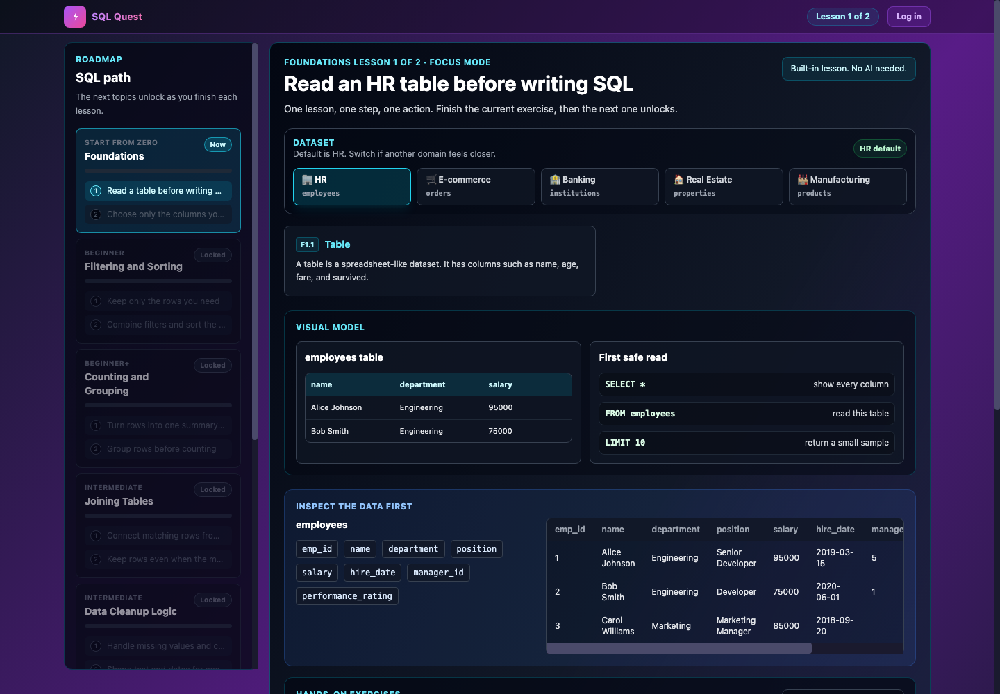

# SQL Quest

SQL Quest is a browser-based SQL learning app for beginners, interview prep, and sector-specific practice. It combines a simple lesson roadmap, hands-on SQL challenges, skill tracking, optional AI tutoring, and static marketing/SEO pages.

Live app: [sqlquest.app](https://sqlquest.app)

## Screenshots

### First-run placement



### Foundations lesson



## What Is Included

- Lesson-first onboarding for new SQL learners.
- Roadmap-based SQL foundations, filtering, grouping, joins, cleanup, subqueries, CTEs, and window functions.
- Browser SQL practice challenges with local execution.
- Sector datasets for HR, ecommerce, banking, real estate, and manufacturing.
- Static landing pages, comparison pages, blog/tutorial pages, and weekly challenge pages.
- Optional Supabase Edge Functions for AI tutor, email capture, referrals, reminders, public profiles, and Stripe webhooks.
- Vercel deployment config and GitHub Actions CI.

## Quick Start

Prerequisites:

- Node.js 20 LTS or newer
- npm 10 or newer

```bash
npm ci
npm run build
npm run dev
```

Open the local server URL printed by `npm run dev`, or serve `public/` directly:

```bash
python3 -m http.server 4321 --bind 127.0.0.1 -d public
```

Then open [http://127.0.0.1:4321/app.html](http://127.0.0.1:4321/app.html).

## Verification

Run the full local check before pushing:

```bash
npm run build:check
npm run smoke -- http://127.0.0.1:4321
```

Useful individual checks:

```bash
npm run lint
npm test -- --run
npm run build
npm run build:validate
```

## Build Outputs

The app is deployed from `public/`. Generated artifacts are committed intentionally:

- `public/app.js` and `public/app.js.map` from `src/app.jsx`
- `public/styles.css` from `src/input.css`
- `public/data.js` from `src/data/*.js`
- copied static pages from `src/*.html` and `src/blog/*.html`
- generated weekly pages from `scripts/build-weekly.js`

## Deployment

Primary production deployment is Vercel:

- Domain: [sqlquest.app](https://sqlquest.app)
- Config: [vercel.json](vercel.json)
- Build command: `npm run build`
- Output directory: `public`

This repo also includes a GitHub Pages workflow:

- Workflow: [.github/workflows/deploy-pages.yml](.github/workflows/deploy-pages.yml)
- It builds the app and uploads `public/` as the Pages artifact.
- In GitHub repo settings, set Pages source to "GitHub Actions".

## Architecture

See [ARCHITECTURE.md](ARCHITECTURE.md) for the runtime model, build pipeline, data flow, deployment paths, and testing strategy.

## Repository Map

```text
src/
  app.jsx              Main React application
  app.html            App shell used by the static deploy
  input.css           Tailwind input
  data/               Challenges, lessons, datasets, sector data
  utils/              Tested helper modules
  blog/               Static tutorial pages
public/
  app.html            Built app shell
  app.js              Built app bundle
  data.js             Built data bundle
  styles.css          Built CSS
  screenshots/        README screenshots
scripts/
  build-*.js          Static-page, weekly, data, and validation scripts
tests/
  *.test.js           Vitest coverage for utilities and product logic
supabase/functions/
  */index.ts          Optional backend functions
api/
  chat.js             Vercel API route for chat proxying
```

## Notes For Contributors

- Keep changes focused and commit generated `public/` files when source changes affect the deployed app.
- Do not commit date-only churn from generated weekly archive pages unless the weekly content actually changed intentionally.
- Run smoke tests against a local static server before pushing UI or onboarding changes.
